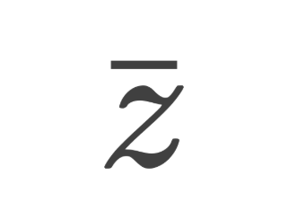

<p align="center">
  
</p>

# Zeal

Zeal is an operating system under development exploring a fractal architecture:
drivers, filesystems, and applications are sealed systems that boot, fail, and
restart independently.

Zeal runs isolated x86-64 cells configured by a versioned boot manifest. Each
cell has private budgeted memory, a lifecycle, and revocable IPC capabilities
with operation rights. Cells can sleep and receive messages with finite tick
deadlines. A fault cold-boots that cell while healthy cells keep running.
Recursive hosting remains future work.

## Build and run

Requires an x86-64 Linux host, GCC, binutils, Make, Python 3.12+, Rust 1.90.0,
Zig 0.15.2, and QEMU.

```sh
make
make run
make test
```

See [building](docs/building.md), [architecture](docs/architecture.md),
[wait contracts](docs/waits.md), and [research tests](docs/testing.md).

## Status

Research software. Storage is RAM-backed and the filesystem exposes one
immutable file. Hardware NVMe, DMA isolation, persistent storage, SMP, and
recursively hosted child systems remain future work.

## License

Apache-2.0. Copyright 2026 Saud Aljuaid.
